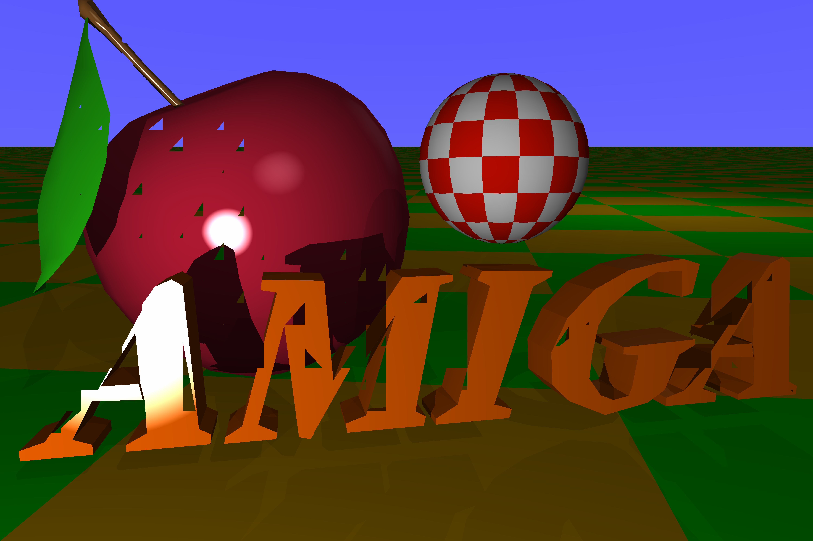

# 6000x4000

This is the resolution for a 35mm negative scanner. The approximation bug of this renderer is in full force, with triangles closest to the camera removed from the scene, especially in the 'AMIGA' and parts of the body of the apple. The ground and boing ball seem unaffected however.

It took a week for my Amiga 1000 to render this image.

