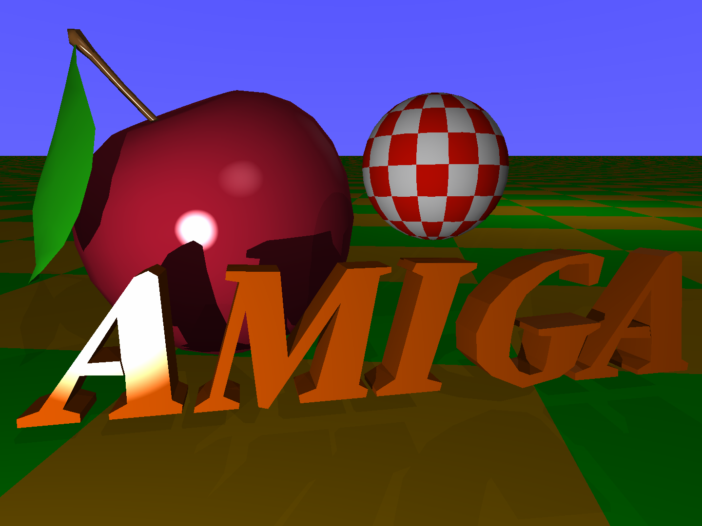

# amiga-sculpt3d-big-render

This GitHub Repository shows a demonstration of Eric Graham's Sculpt 3D ray tracing software from 1987, rendering a complex scene at very high resolutions, at 24 bits color depth.



## The .scene file

The .scene file can be loaded into Sculpt 3D to re-create the scenes. If the number of bit planes specified is 6 or below, an IFF ILBM image will be generated, if the number of bitplanes specified is higher, three raw channel files will be created at the specified bit depth (e.g. 24).

## The .r .g .b files

When rendering above 6 bitplanes of color depth, Sculpt 3D outputs a trio of red, green, and blue channel files at 8 bits (one byte) per pixel, which must be recombined to be displayed on the target system, e.g. either using a utility, or by loading each output channel into the memory of a frame buffer.

## A note on the 6000x4000 output

The 6000x4000 output would be a maximum resolution for a 35mm film scanner, and it highlights an approximation bug of the ray tracer, causing triangles to be skipped.

## combine

The 'combine' utility is an example of a piece of software that can take the individual .r .g and .b files, and create a SUN Rasterfile output that can be read and displayed on a workstation. It takes 6 parameters, the .r .g .b files, the output raster file, and the width and height of the channel files. e.g.

``` sh
./combine boing.r boing.g boing.b boing.ras 6000 4000
```
