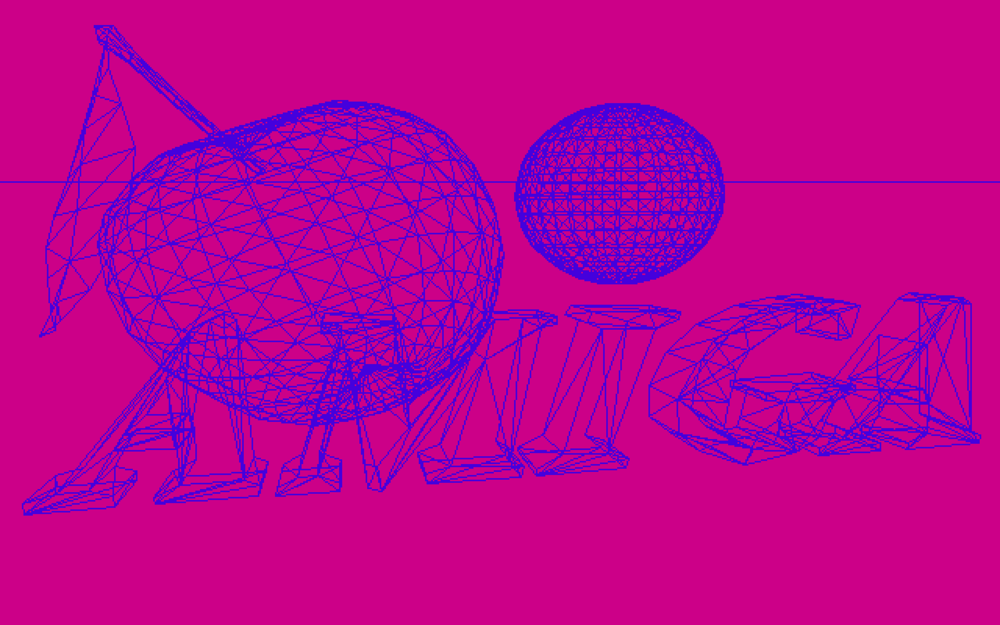
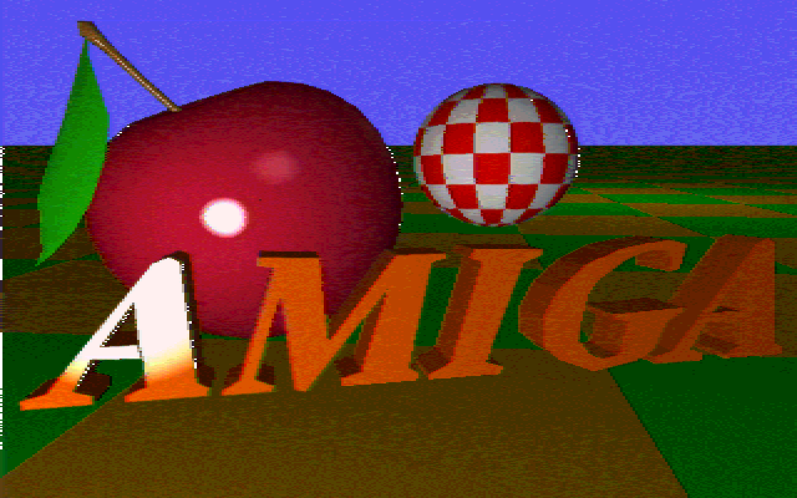
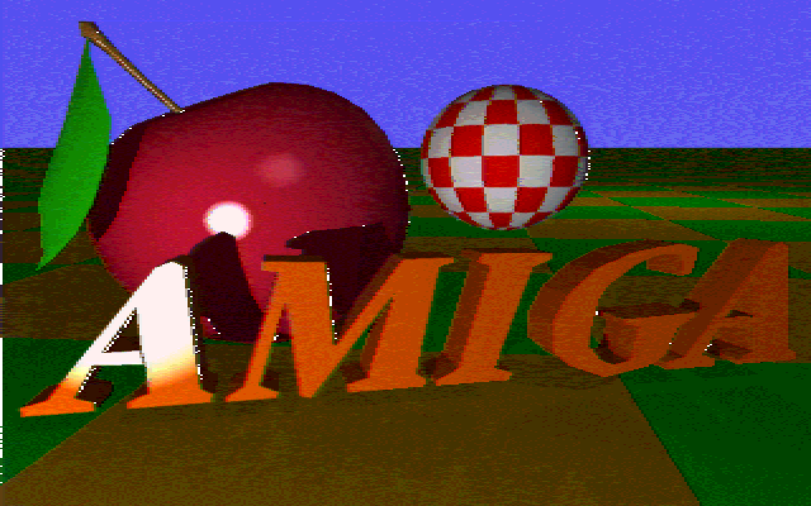

# amiga

The files in this directory are renders that can be directly displayed on an Amiga (such as my Amiga 1000), and use its native graphics modes.

Each of the PNG images in this directory have been enlarged by a factor of 8 to render well on modern 4K displays, but without any pixel interpolation.

## wireframe

The wireframe view renders the triangles, without any Z axis removal. High resolution 640x400 at 16 colors (4 bitplanes)

## painting

The painting view renders the triangles as filled faces using the "painter's algorithm" back to front. High resolution at 16 colors, 640x400 (4 bitplanes)

## snapshot

The Snapshot view is a not-quite-scan-line ray tracing method that approximates the textures, but does not render shadows. HAM at 4,096 colors 320x400 (6 bitplanes)

## photo

The Photo view is a complete ray tracing, not only rendering the textures, but also properly rendering shadows from the light source. HAM at 4,096 colors, 320x400 (6 bitplanes)

